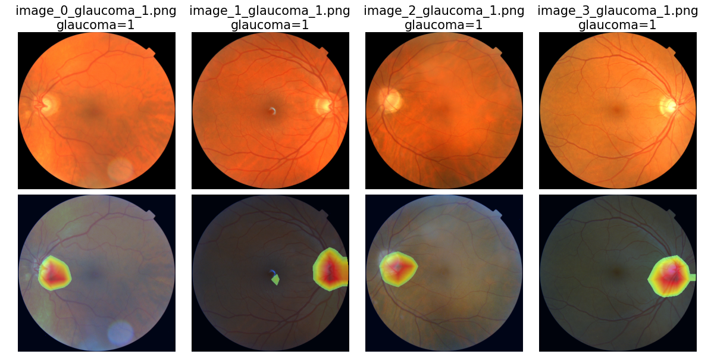
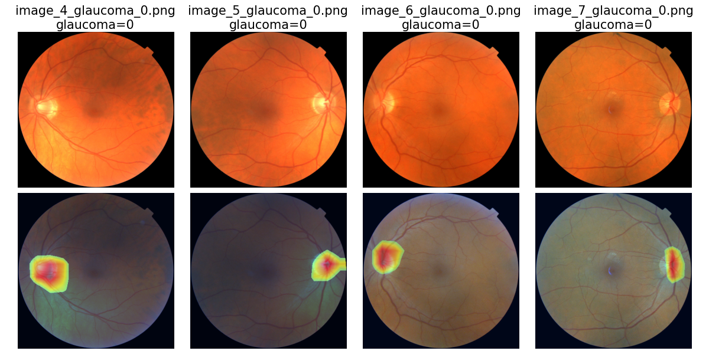

# FundusNet
FundusNet: a deep learning approach for identifying novel endophenotypes for neurodegenerative and eye diseases from fundus images


Hu, W., Li, K., Gagnon, J., Wang, Y., Raney, T., Chen, J., Chen, Y., Okunuki, Y., Chen, W., & Zhang, B. (2025). FundusNet: A Deep-Learning Approach for Fast Diagnosis of Neurodegenerative and Eye Diseases Using Fundus Images. Bioengineering, 12(1), 57. https://doi.org/10.3390/bioengineering12010057

## Steps:
1. git clone the repo
2. Execute either shgender.sh or shage.sh to run individual CNN or ViT models:\
   a. This process will split the image dataset into training and testing sets, train the CNN/ViT models on the training data, and evaluate them on the test data.\
   b. Users must provide the following inputs:\
    'name of csv_file (string)': Path to the CSV file containing annotations.\
    'root_dir (string)': Directory containing all images.
3. Combine the results using majority voting for ensemble prediction.

## A tutorial for result interpretation using gradCAM:

```python
import os
import numpy as np
import math

import torch
from pytorch_grad_cam import GradCAM 

from modelwrapper import Modelwrapper
from gcam_utils import run_save_gcam_results
```


```python
# specify input files
device = torch.device("cuda:0" if torch.cuda.is_available() else "cpu")

model_name = 'regnety_32'
pheno_name = 'glaucoma'

cmodel_ckpt = f'../model_ckpt/{pheno_name}_{model_name}_v0.pth'
csv_file = f'../result_biomarker_interpretation/input_imgs/imgs_{pheno_name}.csv'
img_dir = '../result_biomarker_interpretation/input_imgs/'
result_dir = '../result_biomarker_interpretation/'
```


```python
# run gradCAM to generate figures for biomarker interpretation
num_classes = 1 if pheno_name=='age' else 2
mwrapper = Modelwrapper(num_classes=num_classes)
cmodel = getattr(mwrapper, model_name)().to(device)
cmodel.load_state_dict(torch.load(cmodel_ckpt))
cmodel.eval()

target_layers = [cmodel.s4.b1.conv3.conv]

use_cuda = True if device.type=='cuda' else False
cam = GradCAM(model=cmodel, target_layers=target_layers, use_cuda=True)

run_save_gcam_results(cam=cam,
                      img_dir=img_dir,
                      result_dir=result_dir,
                      csv_file=csv_file,
                      pheno_name=pheno_name)
```

    ['image_0_glaucoma_1.png', 'image_1_glaucoma_1.png', 'image_2_glaucoma_1.png', 'image_3_glaucoma_1.png']
    ['image_4_glaucoma_0.png', 'image_5_glaucoma_0.png', 'image_6_glaucoma_0.png', 'image_7_glaucoma_0.png']


    

    


    

    


```python

```
